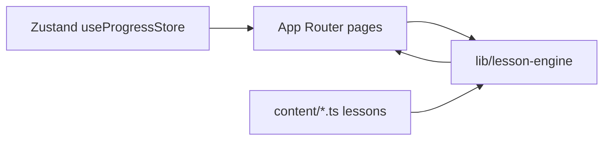

# Architecture — Python Prep Lab

## Stack

- **Next.js** (App Router), **TypeScript**, **Tailwind CSS v4**, **Framer Motion**, **Zustand** with **localStorage** persistence.

## High-level flow

## Routes

| Path | Role |
|------|------|
| `/` | Home |
| `/learn` | Learning path |
| `/lesson/[lessonId]` | Lesson player |
| `/practice` | Practice arena |
| `/progress` | Stats |
| `/review` | Weak-topic lesson list |
| `/settings` | Accessibility + reset |

## Content pipeline

- **`content/modules.ts`**: module metadata and ordered `lessonIds`.
- **`content/lessons/module-*.ts`**: `Lesson` objects (steps arrays).
- **`content/index.ts`**: `allLessons`, `lessonById`, re-exports `modules`.

## Lesson engine

- **`lib/lesson-engine/evaluate.ts`**: `evaluateStep`, text normalization, `stepRequiresCorrectAnswer`.
- **`lib/lesson-engine/load-lesson.ts`**: `getLessonById` from `allLessons`.

## Progress and unlocks

- **`lib/progress/store.ts`**: persisted lesson progress, streak, concept miss counts, settings.
- **`lib/progress/unlock.ts`**: flat lesson order, `isLessonUnlocked` (previous lesson must be completed).
- **`lib/progress/navigation.ts`**: continue/next lesson helpers for Home.
- **`lib/progress/use-lesson-access.ts`**: client hook for locked lessons on direct URLs.

## Key UI components

- **`components/lesson/LessonPlayer.tsx`**: step state, scoring, hints, completion.
- **`components/lesson/StepBody.tsx`**: static and interactive step views.
- **`components/layout/AppShell.tsx`**: global chrome.
